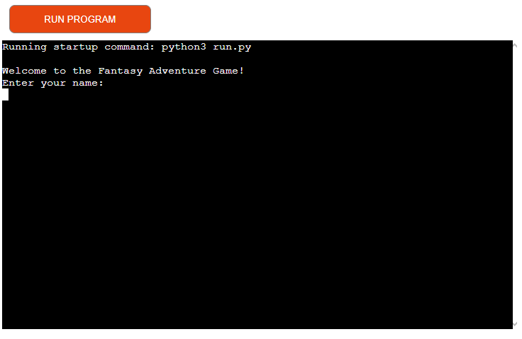
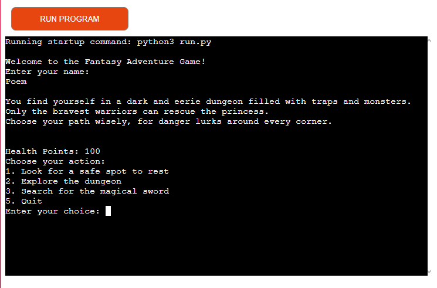
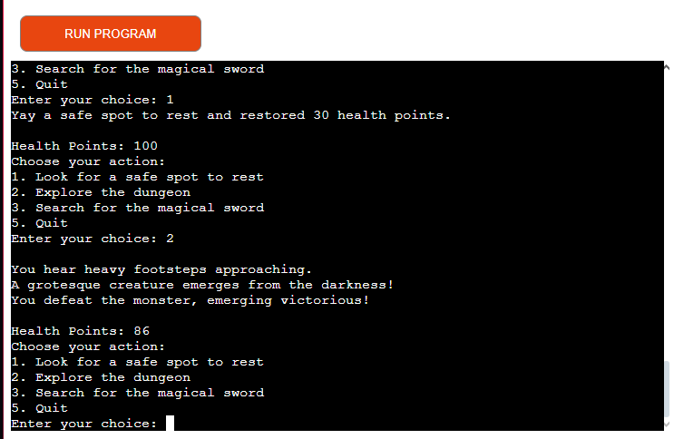
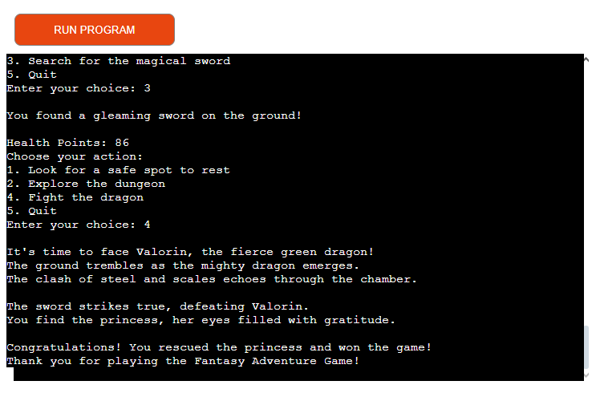
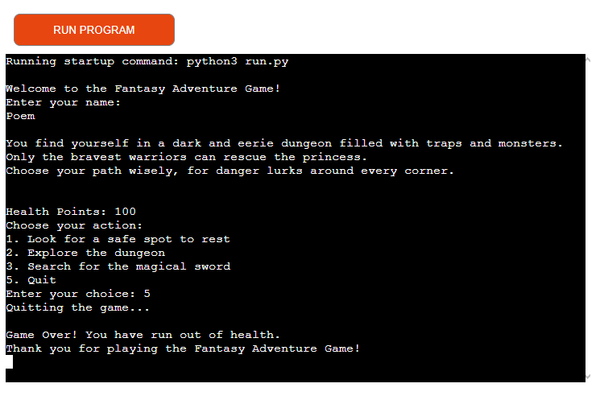

# Fantasy Adventure Game

This is a classic text-based fantasy adventure game implemented in Python. In this game, the player navigates through a dark and eerie dungeon filled with traps, monsters, and the ultimate challenge of defeating a dragon to rescue the princess.

[Link to the live version of my project](https://text-adventure-game4411-401cdff8aacc.herokuapp.com)

## Player Class

The `Player` class represents the protagonist of the game. It contains attributes such as the player's name, health points, and flags indicating progress in the game (e.g., whether the player has rescued the princess or defeated the dragon). The class also includes methods for various actions the player can take, such as clearing traps, resting, encountering monsters, and fighting the dragon.

## Main Function

The `main` function serves as the entry point for the game. It initializes the player, provides an introduction to the game's storyline, and enters a loop where the player can choose actions to progress through the game. The loop continues until either the player rescues the princess, runs out of health points, or quits the game.

## How to Play

1. **Initialization**: Upon starting the game, the player is prompted to enter their name.

2. **Game Loop**: The player navigates through the dungeon by choosing actions such as resting, exploring, searching for the magical sword, and fighting the dragon.

3. **Encounters**: Throughout the game, the player encounters various challenges, including monsters, traps, and empty rooms. The outcome of these encounters depends on the player's choices and luck.

4. **Goal**: The ultimate goal is to rescue the princess by defeating the dragon. However, the player must first find the magical sword to stand a chance against the dragon.

5. **Outcome**: The game ends with either victory (rescuing the princess) or defeat (running out of health points).

## Future Features
- Make the game longer.
- A better fighting system.
- Magic feature.

## Testing

- I have manually tested this project by doing the following:
    - Passed the code through a PEP8 validator and confirmed no problems.
    - Given invalid inputs and verified that everything behaves as expected.
    - Tested on my local terminal and on the Code Institute Heroku terminal.

## Bugs
- Only one bug is known: the suggestions do not update correctly from 1-4 and later, when the magical sword is found, to 1-5.

## Deployment

This project was deployed using Code Institute's mock terminal for Heroku.

- Steps for deployment:
    - Fork or clone this repository.
    - Create a new Heroku app.
    - Set the buildpacks to Python and NodeJS in that order.
    - Link the Heroku app to the repository.
    - Click on deploy.

## Credits

- Code Institute for the deployment terminal.
- ChatGPT for spell checking and grammar correction.
